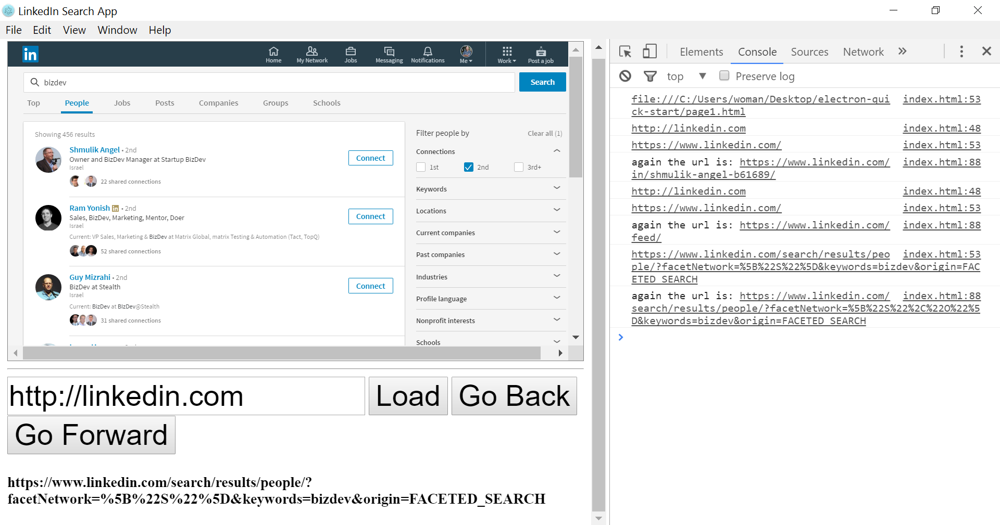

Tool for using the world's biggest database of data about professionals.

Over 100 Million professionals log into LinkedIn every day.

Currently playing with the string of the url and doing interesting things with it.

Instructions:

1. Git Clone the repo

2. "npm install"

3. "electron ."

(Remember to add the "http://" before the url you want to load)